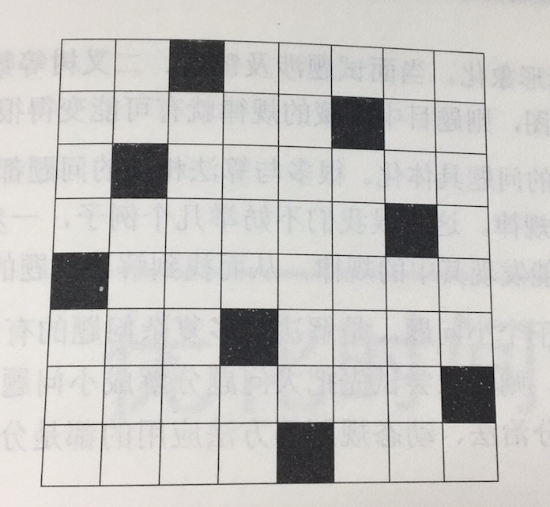

### 目录

* [3.数组中重复的数字](#数组中重复的数字)
* [9.用两个栈实现队列](#题目9 用两个栈实现队列)
* [测试](#测试：哈)


#### 3.数组中重复的数字

##### 题目1 找出数字中重复的数字
题目：在一个长度为n的数组里的所有数字都在0~n-1的范围内，数组中某些数字是重复的，但不知道有那几个数字重复了，也不知道每个数字重复了几次。请找出数组中任意一个重复的数字。例如，如果输入长度为7的数组{2，3，1，0，2，5，3}，那么对应的输出是重复的数字2或者3

##### 题目2 不修改数组找出重复的数字
题目：在一个长度为n+1的数组里的所有数字都在1~n的范围内，所以数组中至少有一个数字是重复的。请找出数组中任意一个重复的数字，但不能修改输入的数组。例如，如果输入长度为8的数组{2，3，5，4，3，2，6，7}，那么对应的输出是重复的数字2或者3。


#### 4.二维数组中的查找
题目：在一个二位数组中，每一行都按照从左到右递增的顺序排序，每一列都按照从上到下的顺序排序。请完成一个函数，输入这样的一个二维数组和一个整数，判断数组中是否含有该整数。

#### 5.替换空格

题目：请实现一个函数，把字符串中的每个空格都替换成"%20"。例如，输入"We are happy."，则输出"We%20are%20happy."。


##### 拓展题
题目：有两个排序的数组A1和A2，内存在A1的末尾有足够多的空余控件容纳A2。请实现一个函数，把A2中的所有数字插入A1中，并且所有的数字是排序的。

#### 测试：哈

#### 6.从尾到头打印链表
题目：输入一个链表的头节点，从尾到头反过来打印每个节点的值。链表节点定义如下：

```
struct ListNode {
	int m_value;
	ListNode* m_pNext;
}	
```

#### 7.重建二叉树
题目：输入某二叉树的前序遍历和中序遍历的结果，请重建该二叉树。假设输入的前序遍历和中序遍历的结果中都不含重复的数字。例如，输入前序遍历序列{1，2，4，7，3，5，6，8}和中序遍历序列{4，7，2，1，5，3，8，6}，则重建如图所示的二叉树并输出它的头结点。二叉树的定义如下：

```
struct BinaryTreeNode
{
	int m_value;
	BinaryTreeNode m_pLeft;
	BinaryTreeNode m_pRight;
}
```

#### 8.二叉树的下一个节点
题目：给定一棵二叉树和其中的一个节点，如何找出中序遍历序列的下一个节点？树中的节点除了有两个分别指向左、右节点的指针，还有一个指向父节点的指针。

#### 题目9 用两个栈实现队列
题目：用两个栈实现一个队列。队列的声明如下，请实现它的两个函数appendTail和deleteHand，分别完成在队列尾部插入节点和在队列头部删除节点的功能。

```
template <typename T> class CQueue
{
public:
    CQueue(void);
    ~CQueue(void);
    
    void appendTail(const T& element);
    T delegeHead();
    
private:
    stack<T> stack1;
    stack<T> stack2;
};
```

#### 拓展题1
题目：如何用两个队列实现一个栈

#### 10.斐波那契数列

##### 题目1
题目：写一个函数，输入n，求斐波那契数列的第n项。斐波那契数列的定义如下：


##### 题目2
题目：一直青蛙一次可以跳上1级台阶，也可以跳上2级台阶。求该青蛙跳上一个n级台阶总共有多少中跳法。

##### 题目3
题目：一只青蛙一次可以跳上1级台阶，也可以跳上n级台阶。。。它也可以跳上n级，此时青蛙跳上一个n级台阶总共有多少种跳法？


#### 11.旋转数组的最小数字
题目：把一个数组最开始的若干个元素搬到数组的末尾，我们称之为数组的旋转。输入一个递增排序的数组的一个旋转，数组旋转数组的最小元素。例如，数组{3，4，5，1，2}为{1，2，3，4，5}的一个旋转，该数组的最小值为1.

#### 12.矩阵中的路径
题目：请设计一个函数，用来判断在一个矩阵中是否存在一条包含某字符串所有字符的路径。路径可以从矩阵中的任意一格开始，每一步可以在矩阵中向左、右、上、下移动一格。如果一条路径经过了矩阵的某一格，那么该路径不能再次进入该格子。例如，在下面的3x4的矩阵中包含一条字符串‘abfb’的路径（路径中的字母用下划线标出）。但矩阵中不包含字符串‘abfb’的路径，因为字符串的第一个字符b占据了矩阵中的第一行第二个格子之后，路径不能再次进入这个格子。


| a | _b_ | t | g |
| --- | --- | --- | --- |
| c | _f_ | _c_ | s |
| j | d | _e_ | h |


#### 13.机器人的运动范围
题目：地上有一个m行n列的方格。一个机器人从坐标（0，0）的格子开始移动，他每次可以向左、右、上、下移动一格，但不能进入行坐标和列坐标的位数之和大于k的格子。例如，当k=18时，机器人能够进入方格（35，37），因为3+5+3+7=18。但它不能进入方格（35，38），因为3+5+3+8=19。请问该机器人能够到达多少个格子。

#### 14.剪绳子
题目：给你一根长度为n的绳子，请把绳子剪成m段（m、n都是整数，n>1并且m>1），每段绳子的长度记为k[0],k[1],...,k[m]。请问k[0] X k[1] X k[2]...X k[m]可能的最大乘积是多少。例如，当绳子的长度为8时。我们把它剪成长度分别为2、3、3的三段，此时得到的最大乘积是18。

#### 15.二进制中1的个数
题目：请实现一个函数，输入一个整数，输出该整数，输出该数二进制中1的个数。例如，把9表示成二进制是1001，有2位是1.因此，如果输入9，则该函数输出2。

#### 16.数值的整数次方

题目：实现函数double Power（double base， int exponent），求base的exponent次方。不得使用库函数，同时不需要考虑大数问题。


#### 17.打印从1到最大的n位数
题目：输入数字n，按顺序打印出1到最大的n位十进制数。比如输入3，则打印出1、2、3一直到最大的3位数999。

#### 18.删除链表节点

##### 题目1 在o(1)时间内删除链表节点
给定单向链表的头指针和一个节点指针，定义一个函数在o(1)时间内删除该节点。链表的节点与函数的定义如下：

```
struct ListNode {
	int m_value;
	ListNode* m_pNext;
}	
void deleteNode(ListNode** pHeader, ListNode *pToBeDeleted);
```

##### 题目2 删除链表中重复的节点
在一个排序的链表中，如何删除重复的节点？例如，在如下(a)中重复的节点被删除之后，链表如下(b)所示。

- (a) 1 -> 2 -> 3 -> 3 -> 4 -> 4 -> 5
- (b) 1 -> 2 -> 5

#### 19.正则表达式匹配
题目：请实现一个函数用来匹配包含'.'和‘* ’的正则表达式。模式中的字符'.'表示任意一个字符， 而'* ' 表示它前面的字符可以出现任意次(含0次)。在本题中，匹配是指字符串中的所有字符匹配整个模式。例如，字符串"aaa"与模式"a.a"和"ab* ac * a"匹配，但与"aa.a"和"ab*a"均不匹配。

#### 20.表示数值的字符串
题目：请实现一个函数用来判断字符串是否表示数值(包括证书和小数)。例如，字符串“+100”、“5e2”、“-123”、“3.1416”及“-1E-16”都表示数值，但“12e”、“1a3.14”、“1.2.3”、“+-5”及“12e+5.4”都不是。


#### 21.调整数组顺序使奇数位于偶数前面
题目：输入一个整数数组，实现一个函数来调整该数组中数字的排序，使得所有奇数位于数组的前半部分，所有偶数位于整数的后半部分。

#### 22.链表中倒数第K个节点
题目：输入一个链表，输出该链表中倒数第K个节点。为了符合大多数人的习惯，本题将从1开始计数，即链表的尾节点是倒数第1个节点。例如，一个链表有6个节点，从头结点开始，他们的值依次是1、2、3、4、5、6。这个链表的倒数第三个节点是值为4的节点。链表节点定义如下：

```
struct ListNode {
	int m_value;
	ListNode* m_pNext;
}
```

##### 拓展题1
求链表的中间节点。如果链表中的节点总数为奇数，则返回中间节点；如果节点总数是偶数，则返回中间两个节点的任意一个。

#### 23.链表中环的入口节点
题目：如果一个链表中包含环，如何找出环的入口节点？例如，在如下图的链表中，环的入口节点为3。

 

#### 24.反转链表
题目：定义一个函数，输入一个链表的头节点，反转该链表并输出反转后链表的头节点。链表节点定义如下：

```
struct ListNode {
	int m_value;
	ListNode* m_pNext;
}
```

#### 25.合并两个排序的链表
题目：输入两个递增排序的链表，合并这两个链表并使新链表中的节点仍然是递增排序的。例如，输入下图的链表1和链表2，则合并之后的升序链表如链表3所示。链表节点定义如下

```
struct ListNode {
	int m_value;
	ListNode* m_pNext;
}
```


- 链表1：1 --> 3 --> 5 --> 7
- 链表2：2 --> 4 --> 6 --> 6
- 链表3：1 --> 2 --> 3 --> 4 --> 5 --> 6 --> 7 --> 8

#### 26.树的子结构
题目：输入两颗二叉树A和B，判断B是不是A的子结构。二叉树的节点的定义如下：


```
struct BinaryTreeNode
{
	int m_value;
	BinaryTreeNode m_pLeft;
	BinaryTreeNode m_pRight;
}
```


#### 27.二叉树的镜像
题目：请完成一个函数，输入一棵二叉树，该函数输出它的镜像。二叉树节点的定义如下：


```
struct BinaryTreeNode
{
	int m_value;
	BinaryTreeNode m_pLeft;
	BinaryTreeNode m_pRight;
}
```

#### 28.对称的二叉树
题目：请实现一个函数，用来判断一棵二叉树是不是对称的。如果一棵二叉树和它的镜像一样，那么它是对称的。例如，如所在图所示的3棵二叉树中，第一棵二叉树是对称的，而另外两棵不是。


#### 29.顺时针打印矩阵
题目：输入一个矩阵，按照从外向里以顺时针的顺序依次打印出每一个数字。例如，如果输入如下矩阵：


| 1 | 2 | 3 | 4 |
| --- | --- | --- | --- |
| 5 | 6 | 7 | 8 |
| 9 | 10 | 11 | 12 |
| 13 | 14 | 15 | 16 |

则依次打印出数字1，2，3，4，8，12，16，15，14，13，9，5，6，7，11，10


#### 30.包含min函数的栈
题目：定义栈的数据结构，请在该类型中实现一个能够得到栈的最小元素的min函数。在该栈中，调用min、push及pop的时间复杂度都是o(1)。


#### 31.栈的压入、弹出序列
题目：输入两个整数序列，第一个序列表示栈的压入顺序，请判断第二个序列是否为该栈的弹出顺序。假设压入栈的所有数字均不相等。例如，序列{1，2，3，4，5}是某栈的压栈序列，序列{4，5，3，2，1}是该压栈序列对应的一个弹出序列，但{4，3，5，1，2}就不可能是该压栈序列的弹出序列。

#### 32.从上到下打印二叉树

##### 题目1：不分行从上到下打印二叉树

从上到下打印出二叉树的每个节点，同一层的节点按照从左到右的顺序打印。例如，输入下图的二叉树，则依次打印出8，6，10，5，7，9，11.二叉树节点的定义如下：

```
struct BinaryTreeNode
{
	int m_value;
	BinaryTreeNode m_pLeft;
	BinaryTreeNode m_pRight;
}
```

##### 题目2：分行从上到下打印二叉树

从上到下按层打印二叉树，同一层的节点按从左往右的顺序打印，每一层打印到一行。

##### 题目3：之字形打印二叉树

请实现一个函数按照之字形顺序打印二叉树，即第一行按照从左到右的顺序打印，第二行按照从右往左的顺序打印，第三行


#### 33.二叉搜索树的后序遍历序列
题目：输入一个整数数组，判断该数组是不是某二叉搜索树的后序遍历结果。如果是则返回true，否则返回false。假设输入的数组的任意两个数字都互不相同。例如，输入数组{5，7，6，9，11，10，8}，则返回true，因为这个整数序列是下图所示二叉搜索树的后序遍历结果。如果输入的数组是{7，4，6，5}，则由于没有哪棵二叉搜索树的后序遍历结果是这个序列，因此返回false。


#### 34.二叉树中和为某一值的路径
题目：输入一棵二叉树和一个整数，打印出二叉树中节点值的和为输入整数的所有路径。从树的根节点开始往下一直到叶节点所经过的节点行程一条路径。二叉树的定义如下：

```
struct BinaryTreeNode
{
	int m_value;
	BinaryTreeNode m_pLeft;
	BinaryTreeNode m_pRight;
}
```

#### 35.复杂链表的复制
题目：请实现函数ComplexListNode* Clone(ComplexListNode* pHead)，复制一个复杂链表。在复杂链表中，每个节点除了有一个m_PNext指针指向下一个节点，还有一个m_PSibilng指针指向链表中的任意节点或者nullptr。节点的定义如下：

struct ListNode
{
    int m_value;
    ListNode* m_pNext;
    ListNode* m_pSibling
};


#### 36.二叉搜索树与双向链表
题目：输入一棵二叉搜索树，将该二叉搜索树转换成一个排序的双向链表。要求不能创建任何新的节点，只能调整树中节点指针的指向。例如，输入下图的二叉搜索树，则输出转换之后的排序双向链表。二叉搜索树节点的定义如下：
struct BinaryTreeNode
{
	int m_value;
	BinaryTreeNode m_pLeft;
	BinaryTreeNode m_pRight;
}


#### 37.序列化二叉树
题目：请实现两个函数，分别用来序列化和反序列化二叉树。

#### 38.字符串的排列
题目：输入一个字符串，打印出该字符串中字符的所有排列。例如，输入字符串abc，则打印出由a、b、c所能排列出来的所有字符串abc、acb、bac、bca、cab和cba。

#### 拓展题1（未剔除重复组合）
题目：输入一个字符串，打印出该字符串中字符的所有组合。例如，输入字符串abc，则它们的组合有a、b、吃c、ab、bc、abc。当交换字符串中的两个字符时，虽然能得到两个不同的排列，但却是同一个组合。比如ab和ba是不同的排列，但只算是一个组合。

#### 拓展题2
题目：将一个含有8个数字的数组，判断有没有可能把这8个数字分别放到正方体的8个定点上，使得正方体上三组相对的面上的4个定点的和都相等


#### 拓展题3
题目：在8x8的国际象棋上摆放8个皇后，使其不能相互攻击，即任意两个皇后不得处在同一行、同一列或者同一条对角线上。下图中的每个黑色格子表示一个皇后，这就是一种符合条件的摆放方法。请问总共有多少种符合条件的摆法。




#### 39.数组中出现次数超过一半的数字
题目：数组中有一个数字出现的次数超过数组长度的一半，请找出这个数字。例如，输入一个长度为9的数组{1，2，3，2，2，2，5，4，2}。由于数字2在数组中出现了5次，超过数组长度的一半，因此输出2。

#### 40.最小的k个数
题目：输入n个整数，找出其中最小的k个数。例如，输入4、5、1、6、2、7、3、8这8个数字，则最小的4个数字是1、2、3、4。

#### 41.数据流中的中位数
题目：如何得到一个数据流中的中位数？如果从数据流中读出奇数个数值，那么中位数就是所有数值排序之后位于中间的数值。如果从数据流中读出偶数个数值，那么中位数就是所有数值排序之后中间两个数的平均值。

#### 42.连续子数组的最大和
题目：输入一个整形数组，数组里有正数也有负数。数组中的一个或者连续多个整数组成一个子数组。求所有子数组的和的最大值。要求时间复杂度为O(n)。

#### 43. 1~n整数中1的出现的次数
题目：输入一个整数，求1~n这n个整数的十进制表示中1出现的次数。例如，输入12，1~12这些整数中包含1的数字有1、10、11和12，1一共出现5次。

#### 44.数字序列中某一位的数字
题目：数字以 0123456789101112131415...的格式序列化到一个字符序列中。在这个序列中，第5位（从0开始计数）是5，第13位是1，第19位是4，等等。请写一个函数，求任意n位对应的数字。

#### 45.把数组排成最小的数
题目：输入一个正整数数组，把数组里所有数字拼接起来排成一个数，打印能拼接出的所有数字中最小的一个。例如，输入数组{3，32，321}，则打印出这三个数字能排成的最小数字321323。

#### 46.把数字翻译成字符串
题目：给定一个数字，我们按照如下规则把它翻译为字符串：0翻译成”a“，1翻译成”b“,...,11翻译成”l“，...，25翻译成”z“。一个数字可能有多少个翻译，例如，12258有5中不同的翻译，分别是”bccfi“、”bwfi“、”bczi“、”mcfi“、”mzi“。请编程实现一个函数，用来计算一个数字有多少种不同的翻译方法。

#### 47.礼物的最大价值
题目：在一个m✖️n的棋盘的每一格都放有一个礼物，每个礼物都有一定的价值(价值大于0)。你可以从棋盘的左上角开始拿格子里的礼物，并每次向右或者向下移动一格，直到到达棋盘的右下角。给定一个棋盘及其上面的礼物，请计算你最多能拿到多少价值的礼物。

#### 48.最长不含重复字符的子字符串
题目：请从字符串中找出一个最长的不包含重复字符的子字符串，计算该最长子字符串的长度。假设子字符串中只包含'a'~'z'的字符。例如，在长字符串"arabcacfr"中，最长的不包含重复字符的子字符串是"acfr"，长度为4。

#### 49.丑数
题目：我们把只包含因子2、3、5的数称作丑数。求按从小到大的顺序的第1500个丑数。例如，6、8都是丑数，但14不是，因为它包含因子7。习惯上我们把1当做第一个丑数。

#### 50.第一次只出现一次的字符
##### 题目1：字符串中第一个只出现一次的字符
在字符串中找出第一个只出现一次的字符。如输入”abaccdeff“，则输出'b'。

###### 相关题1
定义一个函数，输入两个字符串，从第一个字符串中删除在第二个字符串中出现过的所有字符。例如，从第一个字符串”We are students“中删除在第二个字符串”aeiou“中出现过的字符得到的结果是”W r stdnts“。

###### 相关题2
定义一个函数，删除字符串中所有重复出现的字符。例如，输入”google“，删除重复的字符之后的结果是”gole“。

###### 相关题3
在英语中，如果两个单词出现的字母相同，并且每个字母出现的次数也相同，那么这连个单词互为变位词。例如，silent与listen、evil和live互为变位词。请完成一个函数，判断输入的两个字符串是不是互为变位词。

##### 题目2：字符流中第一个只出现一次的字符
请实现一个函数，用来找出字符流中第一个只出现一次的字符。例如，当从字符流中只读出前两个字符”go“时。第一个只出现一次的字符是‘g’；当从该字符流读出前6个字符”google“时，第一个只出现一次的字符是‘l’。


#### 51.数组中的逆序对
题目:在数组中的两个数字，如果前面一个数字大于后面的数字，则这两个数字组成一个逆序对。输入一个数组，求出这个数组中的逆序对的总数。例如，在数组{7，5，6，4}中，一共存在5个逆序对，分别是(7,5)、(7,6)、(7,4)、(6,4)和(5,4)。

#### 52.两个链表的第一个公共节点
题目：输入两个链表，找出他们的第一个公共节点。链表节点定义如下：

```
struct ListNode {
	int m_value;
	ListNode* m_pNext;
}
```


